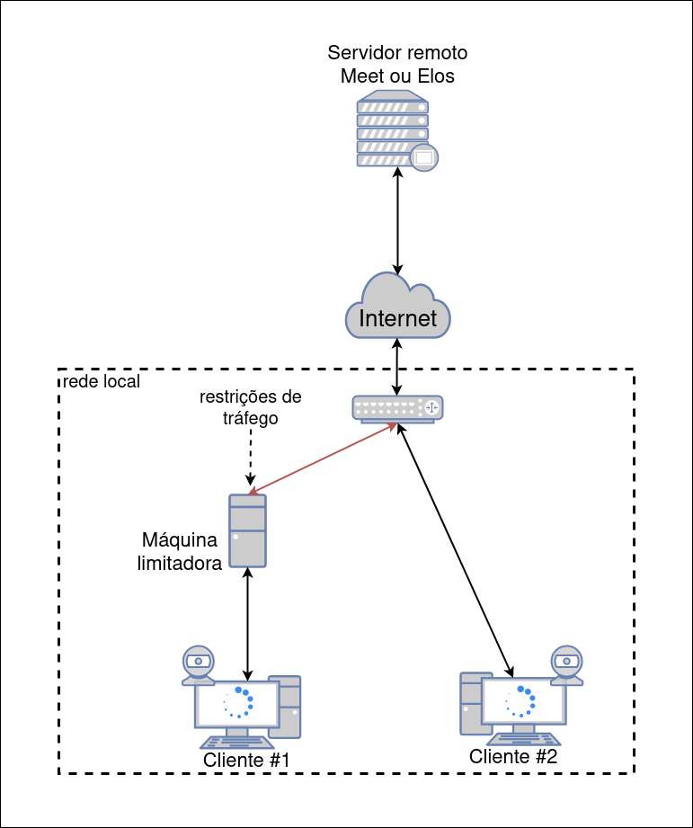

# Framework for collecting metrics about common videoconferencing applications

This repository contains the work developed during my master's degree. It is a framework for running experiments, simulating different network conditions, and collecting metrics about common videoconferencing applications. This branch specifically focuses on running experiments and simulating dynamic network conditions.

## Architecture

The architecture in which this framework is supposed to be run is shown in the picture below:



## Project structure
The project structure is organized as follows:
  - `client#1` folder corresponds to client#1 in the architecture. It has code to automate all the manual processes in the experiment, such as opening the browser, writing the videoconferencing room's URL, joining the room, sharing the webcam, quitting the videoconferencing room, and downloading the metrics.
  - `limiter` folder corresponds to the limiter machine in the architecture. It has a bash script to apply static constraints to the client#1 link and also has a Python script to read constraints from a CSV trace file.
  - `client#2` folder corresponds to client#2 in the architecture. It has code to communicate with client#2 and perform automated actions based on commands coming from client#1, such as writing the videoconferencing room's URL, joining the room, and collecting metrics.
  - `common` folder contains files that are used by all the three aforementioned nodes.
  - `media` folder has pictures of the buttons that should be clicked to automate the interface actions. These files are also used by `client#1` and `client#2`.
  - `scripts` folder has scripts to clear the project's temporary files.

## Running
- To initiate the project, run the below code in the project root folder:
  ```sh
  pip3 install -e .
  ```
- Installing python dependencies:
  ```sh
  pip3 install -r requirements.txt
  ```
- This project is intended to be run by cloning it onto each machine of the architecture and running the code of its corresponding folder. The correct order is:
  1. Limiter
  2. Client#2
  3. Client#1
  
  This order is important because both Limiter and Client#2 are controlled by Client#1, it means that, right after they start, a socket is opened and they keey waiting for Client#1 messages.

For more information about running each node's code, refer to the corresponding folder's README.

## Results
After running experiments, the collected metrics, as well as the recorded videos and other files can be found in the 'output' folder, grouped by the experiment foder name.

## Troubleshooting
- It is expected that each time this project is cloned onto another computer (or even when not have been changed), the screenshots of the buttons located in the `media` folder have to be updated. Otherwise the buttons won't be recognised by the pyautogui lib(the reason is still unknown).

- The scripts of Client#1 and Client#2 use the built-in recording tool of Ubuntu, which is triggered by the shortcut (CTRL + Shift + Alt + R). This tool has a default maximum recording time, which is not very long and should be increased to avoid experiments' recordings being cut off. To do that, run:
  ```sh
  gsettings set org.gnome.settings-daemon.plugins.media-keys max-screencast-length 1800
  ```
- Erro when installing python `beepy` package error `#include <alsa/asoundlib.h>`, run:
  ```sh
  sudo apt install libasound2-dev
  ```
